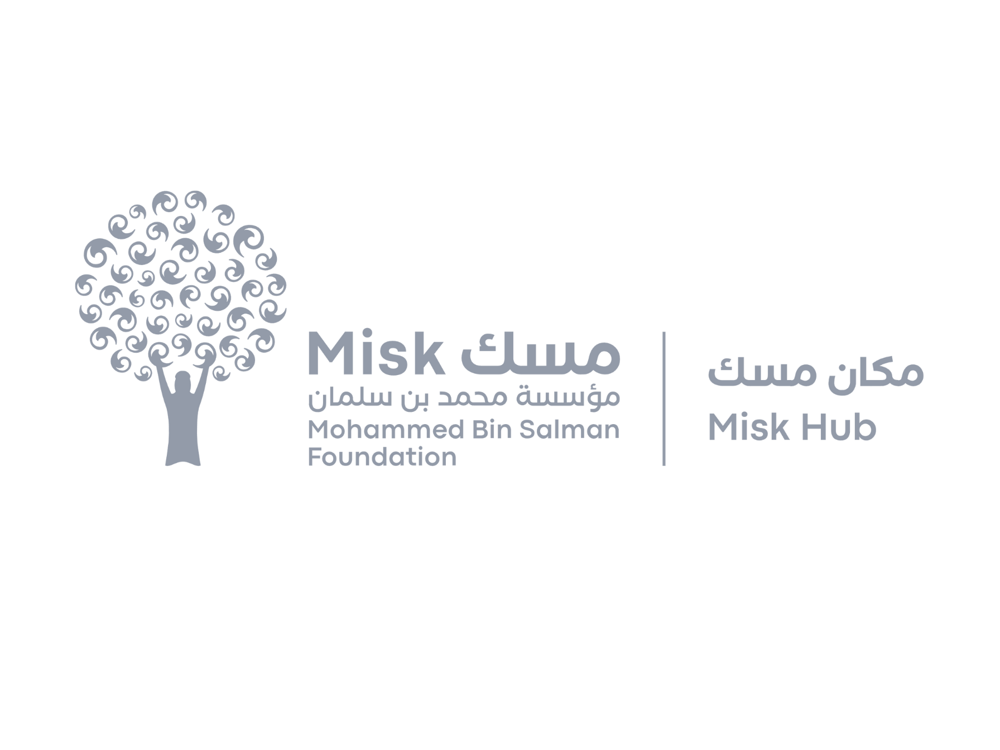

# Pave the Way Capstone Project
<!-- Improved compatibility of back to top link: See: https://github.com/othneildrew/Best-README-Template/pull/73 -->
<a name="readme-top"></a>


<!-- PROJECT LOGO -->
<br />
<div align="center">
  <a href="https://github.com/github_username/repo_name">
    
     
    
  </a>

  <h3 align="center">Capstone Project</h3>

  <p align="center">
    This capstone project is to fulfill the graduation requirements of Samsung Innovation Campus - Immersive with MISK Skills.
  </p>
</div>


 

## Team Members
* NOUF ALJOHANI [`@NoufJoh`](https://github.com/NoufJoh)
* Nada Alghamdi  [`@nado-alghamdi`](https://github.com/nado-alghamdi)
* Noura Alluhaidan [`@noura-alluhaidan`](https://github.com/noura-alluhaidan)
* Haya Albaqami  [`@progHYA`](https://github.com/progHYA)
* Reem Almubark [`@ReeXD`](https://github.com/ReeXD)
* Mai Albqami [`@Mayalbogami`](https://github.com/Mayalbogami)


<!-- ABOUT THE PROJECT -->
## About The Project
<br />
<div align="center">
  <a href="https://noufjoh.github.io/try/" >
    
  </a>
     
  </a>
</div>
<br />
In this exciting project, we developed an automated road damage detection model that leverages state-of-the-art technology to analyze images of roads. Our model is specifically designed to accurately detect and classify various types of road damage, such as cracks and potholes, into two categories: poor, or very poor. This enables immediate reporting and facilitates prompt maintenance actions, ultimately enhancing road safety, optimizing resource allocation, and providing valuable insights for data-driven decision-making in road infrastructure management.

Our team worked tirelessly to preprocess and annotate the images used to train the model. We used the powerful YOLOv8 algorithm to train three different model types: Yolov8n, Yolov8m, and Yolov8l, and carefully evaluated their performance to select the best one. The chosen model was then deployed on a user-friendly webpage that allows users to easily upload an image of the road and receive an instant classification of its condition as either "poor" or "very poor," depending on the extent of the damage, if any, detected.

**Let's Pave the Way to safer journeys together!**

 `Data-Science-Campus-Capstone-Project`, `Object-Dectection`,`Yolov8`,`road-damages`, `pothole`, `cracks`, `AI-Capstone-Project`


### Built With

* Python;
* Pandas;
* NumPy;
* Plotly;
* Matplotlib;
* Seaborn;
* [OpenCV](https://pypi.org/project/opencv-python/)
* [YOLOv8](https://github.com/ultralytics/ultralytics)
* [ONNX](https://github.com/onnx/onnx)


<!-- GETTING STARTED -->

### Prerequisites

Before using the jupyter notebook, ensure to install all the libraries stored in the requirements.txt file.
* Requirements installation using pip
  ```
  pip install -r requirements.txt
  ```
  

### Installation

1. Install the required libraries from the requirements.txt
2. Clone the repo
   ```sh
   git clone https://github.com/NoufJoh/pave-the-way-Capstone-Project.git
   ```
3. Open the part-one Jupyter notebook for data preprocessing and exploratory data analysis (EDA), this includes annotations (split_data.py)

4. Open the part-two Jupyter notebooks for machine-learning model training and evaluations (this contains 4 notebooks)
   * 1. YOLOv8m (Medium Model) -- containing two trials
     2. YOLOv8l (Large Model) - containing four trials
     3. YOLOv8n (Nano Model) - containing 7 trials.
     4. Best Model - containing the best models of a,b, and c, to choose the best model overall to deply the project [Here](https://github.com/NoufJoh/try/)


<!-- LICENSE -->
## License

Distributed under the MIT License. See `LICENSE.txt` for more information.


<!-- CONTACT -->
## Contact
* NOUF ALJOHANI - [Linkedin](https://www.linkedin.com/in/nouf-aljohani-3785191b3/)
* Nada Alghamdi - [Linkedin](www.linkedin.com/in/nada--alghamdi)
* Noura Alluhaidan [Linkedin]()
* Haya Albaqami  - [Linkedin](https://www.linkedin.com/in/haya-albaqami-97b91823a)
* Reem Almubark - [Linkedin]()
* Mai Albqami - [Linkedin](https://www.linkedin.com/in/may-albogami-1509a11a4)

—

## Links
* Project Link: [Pave-the-Way-Capstone-Project](https://github.com/NoufJoh/pave-the-way-Capstone-Project)
* Webpage Link: [Pave the Way](https://noufjoh.github.io/try/)
* Webspage Repo: [Deployment Repo](https://github.com/NoufJoh/try)


<!-- ACKNOWLEDGMENTS -->
## Acknowledgments

* [Misk Immersive Programs](https://hub.misk.org.sa/programs/skills/misk-immersive-programs/)
* [Samsung Innovation Campus](https://innovationcampusksa.thinkific.com/)
* [Data Source](https://www.kaggle.com/datasets/prudhvignv/road-damage-classification-and-assessment)


<p align="right">(<a href="#readme-top">back to top</a>)</p>


